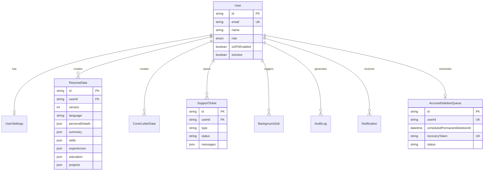

# 🏛️ System Architecture - GlassHub Professional Resume

This document details the system architecture of **GlassHub Professional Resume**, explaining the component topology, design patterns, data flow between microservices, and technical justifications behind every engineering decision.

---

## 🧠 Didactic Analogy: "The High-End Restaurant"

To intuitively understand the GlassHub ecosystem, consider the system as a **high-end fine dining restaurant**:

1. **Nginx (The Front Desk Host):** Greets arriving guests (HTTP requests), validates permissions, and directs them to the correct table (Frontend SPA or Backend API).
2. **Frontend React (The Interactive Menu):** The guest interacts with a polished visual interface to customize their order (fill in resume fields, select a Glassmorphic theme).
3. **Backend Express (The Head Waiter / Maître):** Takes the order, validates the request, and coordinates with the kitchen and storage room.
4. **PostgreSQL (The Main Pantry & Cold Storage):** Safely stores all ingredients and recipes in organized shelves (relational tables for users, resumes, tickets, and logs).
5. **Redis + BullMQ (The Kitchen Order Ticket Line):** When a complex order arrives (such as rendering an A4 PDF or translating a resume via LLM), the waiter pins a ticket to the queue rather than standing around waiting.
6. **Asynchronous Workers (Specialized Line Cooks):**
   - **`worker-pdf`**: Specialized in baking flawless PDFs using headless Chromium in a calibrated Linux environment.
   - **`worker-translation`**: Specialized in translating text between Portuguese and English via LLMs without corrupting JSON structures.
   - **`worker-notif`**: Specialized in dispatching transactional emails and system notifications.
7. **Datadog APM (The Kitchen Health & Timer Inspector):** Tracks execution times for every task and alerts the team if latency or error rates spike.

---

## 🏗️ System Topology Overview

The diagram below illustrates the communication structure between Docker containers:

```
                                  [ Port 80 ]
                                 ┌────────────┐
                                 │   NGINX    │ (Reverse Proxy & Security Gateway)
                                 └─────┬──────┘
                                       │
                       ┌────────────────┴────────────────┐
                       ▼                                 ▼
              ┌─────────────────┐               ┌─────────────────┐
              │    Frontend     │               │   Backend API   │
              │  (Vite + React) │               │    (Express)    │
              └─────────────────┘               └────────┬────────┘
                                                         │
                       ┌────────────────┬────────────────┼────────────────┐
                       ▼                ▼                ▼                ▼
               ┌───────────────┐ ┌─────────────┐ ┌─────────────┐ ┌─────────────┐
               │  PostgreSQL   │ │    Redis    │ │   Ollama    │ │   Datadog   │
               │  (pg_data)    │ │   (Queues)  │ │ (Llama 3.2) │ │   (APM)     │
               └───────────────┘ └──────┬──────┘ └─────────────┘ └─────────────┘
                                        │
                 ┌──────────────────────┼──────────────────────┐
                 ▼                      ▼                      ▼
         ┌───────────────┐      ┌───────────────┐      ┌───────────────┐
         │ worker-trans  │      │ worker-pdf    │      │ worker-notif  │
         │ (Translation) │      │ (Puppeteer)   │      │ (Multi-chan)  │
         └───────────────┘      └───────────────┘      └───────────────┘
```

---

## 🧩 System Components

### 1. Nginx Reverse Proxy (`../nginx`)
- **Role:** Single public entry point listening on port `80`.
- **Responsibilities:**
  - Proxies `/api/*` and `/socket.io/*` traffic to the Backend Express container.
  - Proxies `/` and static assets to the Frontend React container.
  - Enforces security headers (CORS, HSTS, X-Frame-Options).
  - Handles response compression via Gzip.

### 2. Frontend SPA (`../frontend`)
- **Tech Stack:** React 18, TypeScript, Vite, Tailwind CSS with custom Glassmorphism utilities (`backdrop-blur-md`, `border-white/10`).
- **UI Architecture:** Based strictly on **Atomic Design** (Atoms ➔ Molecules ➔ Organisms ➔ Templates ➔ Pages).
- **Core Features:**
  - Public Landing Page with Gateway Modal.
  - Split-View Editor (Form input on the left, real-time preview on the right).
  - 4 Dynamic Resume Themes: `GlassModern`, `GlassMinimalist`, `GlassExecutive`, `GlassCompact`.
  - Symmetrical Link Balancing Algorithm (2x2, 3x2, 1x4 grids).

### 3. Backend API (`../backend`)
- **Tech Stack:** Node.js, Express, Prisma ORM, JSON Web Tokens (JWT), Speakeasy (2FA/TOTP).
- **Functions:**
  - Authentication and Role-Based Access Control (`USER` and `ADMIN`).
  - Resume CRUD and version control per language (`pt-BR` / `en-US`).
  - ATS (Applicant Tracking System) scoring engine.
  - Support Ticket Management and Real-Time Chat streaming via SSE / WebSockets.
  - Account Soft-Deletion (30-day grace period) and permanent purge jobs.

### 4. Asynchronous Queue Processing (`../backend/workers` & BullMQ + Redis)
To keep HTTP endpoints fast and responsive, heavy tasks are offloaded to **BullMQ on Redis 7**:

| BullMQ Queue | Assigned Worker | Description |
| :--- | :--- | :--- |
| `pdf-export` | `worker-pdf.js` | Launches headless Puppeteer, injects selected theme HTML/CSS, applies calibrated A4 styles, and returns PDF buffer. |
| `translation` | `worker-translation.js` | Connects to LLM (TranslateGemma / Llama 3.2 via Ollama) to translate resume payloads between languages while preserving JSON schemas. |
| `notifications` | `worker-notif.js` | Dispatches transactional emails (recovery tokens, PDF ready alerts, deletion reminders). |

---

## 📊 Relational Data Model (PostgreSQL + Prisma)

The database uses PostgreSQL 16 managed via Prisma ORM defined in [`schema.prisma`](../backend/prisma/schema.prisma):



---

## 📡 Telemetry & Hybrid Observability

GlassHub employs a **Hybrid Observability** architecture:

1. **Datadog APM & DogStatsD:**
   - Captures HTTP traces, Prisma query performance, and BullMQ queue metrics.
   - Emits custom DogStatsD metrics over UDP port `8125` to the Datadog Agent.

2. **`SystemExecutionLog` Table (PostgreSQL):**
   - Records structured execution logs in PostgreSQL for real-time querying inside the **Admin Cockpit**.
   - Enables filtering by `service`, severity `level` (`INFO`, `WARN`, `ERROR`), `traceId`, and duration in milliseconds.

---

## ⚖️ Key Architectural Decisions & Trade-Offs

### 1. Why PostgreSQL with Prisma over NoSQL / MongoDB?
- **Rationale:** User settings, resumes, versioning, tickets, and audit logs have strict relational contracts. PostgreSQL offers ACID compliance, foreign key constraints, and native `Json` columns for dynamic skill/experience structures.

### 2. Why Server-Side Puppeteer Linux Workers over Client-Side HTML2PDF?
- **Rationale:** Client-side HTML2PDF relies on local browser rendering engines, leading to layout drifts across OS platforms, missing fonts, and print scaling bugs. Running Puppeteer in a calibrated Linux container guarantees **100% identical PDF output** for all users worldwide.

### 3. Why a 30-Day Soft Account Deletion Grace Period?
- **Rationale:** Enhances security and LGPD/GDPR compliance. When a user requests account deletion, a single-use recovery token is dispatched via email and the account is placed in `AccountDeletionQueue`. A scheduled BullMQ job purges the data permanently after 30 days if not recovered.
